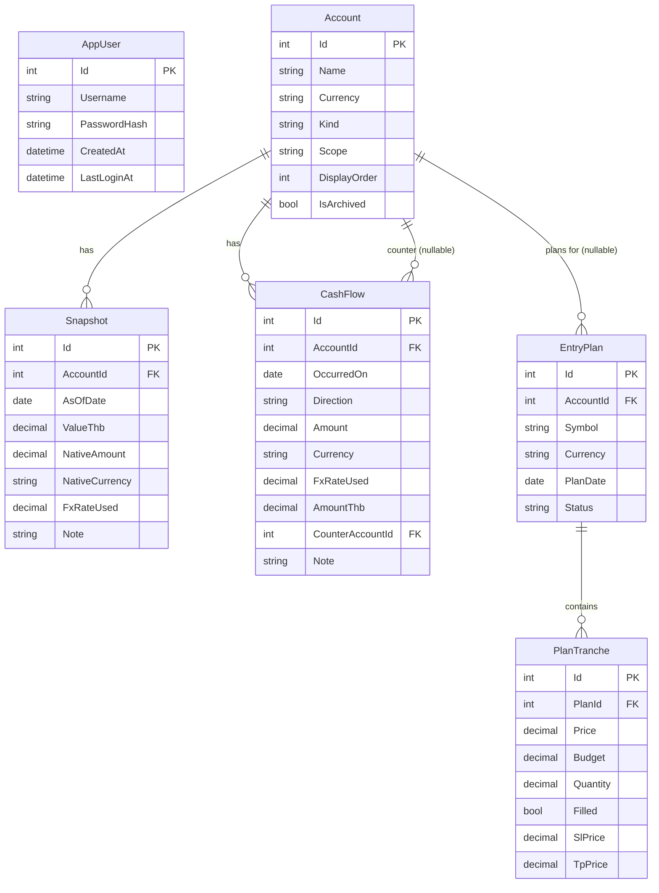

# Data Model & Authentication

Reference for the database schema, authentication design, and deployment shape
of the Portfolio & Net Worth Tracker. Companion to `CLAUDE.md` (the spec) and
`portfolio-tracker-design-brief.md` (the UX brief). Where this document and
`CLAUDE.md` disagree, `CLAUDE.md` wins — but they are kept in sync deliberately.

**Stack:** ASP.NET Core Minimal API + EF Core + **PostgreSQL** (backend),
Next.js 16 App Router + TypeScript + Tailwind (frontend).

---

## 1. Conventions

- **Money & quantity are never floats.** Every monetary or quantity column is
  `decimal(18,8)` → maps to Postgres `numeric(18,8)`. Crypto amounts and
  fractional shares survive intact.
- **Dates are `date`-only** where the time of day carries no meaning.
- **Enums are stored as strings**, not ints — raw data stays readable and the
  Postgres migration is safe. Configure with EF Core
  `.HasConversion<string>()`.
- **No repository abstraction.** Endpoint handlers talk to the `DbContext`
  directly, grouped by feature.
- Provider-specific SQL stays out of the domain so the schema remains portable.

### Enums

| Enum | Values |
|---|---|
| `Currency` | `THB`, `USD` |
| `AccountKind` | `Cash`, `FX`, `Equity`, `Crypto`, `Liability` |
| `Scope` | `Banking`, `Investment` |
| `Direction` | `In`, `Out` |
| `PlanStatus` | `Active`, `Completed`, `Abandoned` |

---

## 2. ER diagram



`AppUser` stands alone — it gates access but owns no domain data (single user).

---

## 3. Tracking side (Part 1)

These three tables answer the two core questions from one dataset: *"How much do
I have?"* (net worth) and *"How good is my investing?"* (investment scope).
Every chart draws two lines — **market value** and **net contribution** — and
the vertical gap between them is profit.

### 3.1 Account

The container. Everything else hangs off it.

| Column | Type | Notes |
|---|---|---|
| `Id` | int PK | |
| `Name` | text | |
| `Currency` | `Currency` | `THB` / `USD` |
| `Kind` | `AccountKind` | `Cash` / `FX` / `Equity` / `Crypto` / `Liability` |
| `Scope` | `Scope` | `Banking` / `Investment` |
| `DisplayOrder` | int | ordering in the UI |
| `IsArchived` | bool | default `false`; soft-hide instead of deleting |

Seeded accounts: bank cash (THB, Banking), FX day-trading (USD, Investment),
Webull (USD, Investment), BTC on Bitkub (THB, Investment).

### 3.2 Snapshot — the backbone of every chart

A **photograph of the account's total value** on a given date (a *level*).
Normally taken every Sunday. Drives the **market value** line.

| Column | Type | Notes |
|---|---|---|
| `Id` | int PK | |
| `AccountId` | int FK → Account | `ON DELETE RESTRICT` |
| `AsOfDate` | date | normally a Sunday |
| `ValueThb` | decimal(18,8) | **source of truth for charting** |
| `NativeAmount` | decimal(18,8) | value in the account's own currency |
| `NativeCurrency` | `Currency` | |
| `FxRateUsed` | decimal(18,8) | `1` for THB accounts |
| `Note` | text null | short free text, shown against the timeline |

- **Index:** unique `(AccountId, AsOfDate)` — prevents duplicate entries for one
  day and accelerates the forward-fill query (latest snapshot ≤ a date).
- The user converts USD → THB at entry time, so `ValueThb` is authoritative.
  `NativeAmount` and `FxRateUsed` are kept anyway so currency effect can be
  separated from performance later. **Never drop them.**
- **Forward-fill:** for any chart date, take each account's most recent snapshot
  on or before that date. A skipped week interpolates across the gap. Never
  substitute zero — that would show a crash that did not happen. An account with
  no snapshot at or before the date contributes nothing, not zero.
- **FX day-trading** is snapshotted on **equity** (open positions included), not
  balance. Label the field accordingly in the UI.
- **Liabilities** store a negative `ValueThb`; summation needs no special case.

### 3.3 CashFlow — what keeps the net-contribution line honest

An **event of money crossing a boundary** (a *flow*). Drives the **net
contribution** line. Only exists when money actually moves.

| Column | Type | Notes |
|---|---|---|
| `Id` | int PK | |
| `AccountId` | int FK → Account | `ON DELETE RESTRICT` |
| `OccurredOn` | date | the **real** date — never rounded to the snapshot week |
| `Direction` | `Direction` | `In` / `Out` |
| `Amount` | decimal(18,8) | |
| `Currency` | `Currency` | |
| `FxRateUsed` | decimal(18,8) | |
| `AmountThb` | decimal(18,8) | |
| `CounterAccountId` | int? FK → Account | non-null ⇒ transfer between own accounts |
| `Note` | text null | |

- **Indexes:** `(AccountId, OccurredOn)` and `(OccurredOn)`.
- **Net contribution moves only when money crosses the boundary of the selected
  view:**

  | Event | Net Worth view | Investment view |
  |---|---|---|
  | Salary → bank | up | n/a |
  | Bank → Bitkub / Webull / FX | no movement (internal) | up |
  | Sell BTC, proceeds stay as cash in Bitkub | no movement | no movement |
  | Withdraw from a portfolio to spend | down | down |

- A `CashFlow` with a non-null `CounterAccountId` is **internal** — it must
  cancel out when both accounts are in the selected scope, and count as external
  when only one is. Decide this by checking whether the counter account is
  inside the currently selected scope — **never hard-code it.**
- **Net contribution can go negative.** More withdrawn than ever deposited means
  capital fully recovered. **Never clamp with `Math.Max(0, …)`.**
- `OccurredOn` carries the true date because time-weighted return chains
  sub-period returns between cash-flow dates (see §6).

> **No Transaction table.** A per-trade detail layer was considered but removed:
> this is a manual, snapshot-driven tracker with no order entry (see the design
> brief), so accounts are valued purely by snapshots + cash flows. If a trade
> ledger is ever needed, reintroduce a `Transaction` entity then — today's schema
> does not depend on one.

---

## 4. Planner side (Part 2)

Forward-looking, **fully independent** of the tracking side. Plans a staged
entry into a stock across several tranches at descending prices and reports the
resulting average cost per share. Matches the validated prototype
`entry-plan-prototype.jsx`.

Relationship: one `EntryPlan` has many `PlanTranche` (cascade delete).

### 4.1 EntryPlan — the plan header (one plan = one stock)

| Column | Type | Notes |
|---|---|---|
| `Id` | int PK | |
| `AccountId` | int? FK → Account | nullable — may be unlinked |
| `Symbol` | text | |
| `Currency` | `Currency` | **default USD**; THB supported for Thai stocks |
| `PlanDate` | date | |
| `Status` | `PlanStatus` | `Active` / `Completed` / `Abandoned` |

- The planner is denominated **per-plan** in `EntryPlan.Currency`. The currency
  symbol and formatting follow that field (USD → `$`, THB → `฿`) — **never
  hard-code `$`.** Amounts inside a plan are all in that one currency; no
  cross-currency conversion happens in the planner.

### 4.2 PlanTranche — each "rung" of the ladder

| Column | Type | Notes |
|---|---|---|
| `Id` | int PK | |
| `PlanId` | int FK → EntryPlan | `ON DELETE CASCADE` |
| `DisplayOrder` | int | manual ladder position; user reorders with up/down arrows |
| `Price` | decimal(18,8) | the price this tranche targets |
| `Budget` | decimal(18,8) | **primary input** |
| `Quantity` | decimal(18,8) | derived (`Budget / Price`), user-editable |
| `Filled` | bool | bought yet? |
| `SlPrice` | decimal(18,8) null | optional stop-loss price for this rung |
| `TpPrice` | decimal(18,8) null | optional take-profit price for this rung |

- **Index:** `(PlanId)`.
- `SlPrice`/`TpPrice` are optional. Loss-if-SL (`Quantity × (Price − SlPrice)`)
  and profit-if-TP (`Quantity × (TpPrice − Price)`), plus the per-plan totals and
  the R:R ratio, are **derived on the client** and not stored.
- `Budget` is primary; `Quantity = Budget / Price`. **Both stay editable and
  update each other:** editing quantity recalculates budget; editing budget or
  **price** holds the budget and recalculates quantity.
- Tranches display in a **manual order** (`DisplayOrder`) the user arranges with
  up/down arrows — not sorted by price; the running average accumulates in that
  displayed order. New rungs append at the bottom and start empty.
- Weighted average: `Σ(Price × Quantity) / Σ(Quantity)`.
- Two headline figures, always shown together:
  - **Cost so far** — average over tranches where `Filled = true`.
  - **If fully filled** — average over all tranches.
- The **running cumulative average** column is the most valuable number on the
  screen: the cost if the user stops after that tranche.
- Fractional shares are normal — never round quantity to an integer.

---

## 5. Authentication

Single user, no sign-up, no roles. **ASP.NET Core Identity is deliberately not
used** — its multi-table machinery serves features this app does not have.

### 5.1 AppUser

| Column | Type | Notes |
|---|---|---|
| `Id` | int PK | |
| `Username` | text | |
| `PasswordHash` | text | PBKDF2 via ASP.NET Core `PasswordHasher<T>` |
| `CreatedAt` | datetime | |
| `LastLoginAt` | datetime null | |

- **Password hashing** uses the built-in `PasswordHasher<AppUser>` (PBKDF2) — no
  extra dependency. Only the hash is ever stored.
- **Seeding:** on startup, if no `AppUser` exists, seed one from configuration
  (`Auth:Username`, `Auth:PasswordHash`). Config comes from environment
  variables / user-secrets / a cloud secret manager — **never committed.** A
  small setup helper generates the hash from a plaintext password so plaintext
  is never persisted anywhere.

### 5.2 Session & endpoints

Cookie-based session via `AddAuthentication().AddCookie()`.

- Cookie flags: `HttpOnly=true`, `Secure=true`, `SameSite=Strict`.
- **Sliding expiration: 1 day.** After a day of inactivity, log in again.
- Endpoints:

  | Method | Route | Purpose |
  |---|---|---|
  | `POST` | `/api/auth/login` | `{ username, password }` → set cookie, `200`/`401` |
  | `POST` | `/api/auth/logout` | clear cookie |
  | `GET` | `/api/auth/me` | `{ username }` or `401` |

- Every other endpoint group (`/api/chart`, accounts, snapshots, cash flows,
  plans, tranches, weekly bulk-entry) is behind `.RequireAuthorization()`.
  `/api/auth/login` is the only anonymous endpoint.

### 5.3 Frontend gating (Next.js 16)

Next.js 16 renamed `middleware.ts` → `proxy.ts` and its guidance is explicit:
**`proxy.ts` is not a security boundary.** Authorization lives at the data
source. Three layers:

| Layer | Role |
|---|---|
| `proxy.ts` | **optimistic redirect only** — no cookie ⇒ send to `/login` (UX) |
| Server Components / Route Handlers | verify identity by calling `/api/auth/me` |
| **.NET API** | **the real authorization gate** — every endpoint `[Authorize]`, returns `401` |

Because all real data sits behind the .NET API's `[Authorize]`, the API *is* the
data-access authorization layer. Bypassing the Next optimistic redirect yields
nothing but `401`s. `proxy.ts` only makes the redirect look clean.

---

## 6. Percentage returns

`(value − netContribution) / netContribution` breaks when net contribution
approaches or crosses zero — **do not display it** in those conditions. For a
real return figure, use **time-weighted return**, chaining sub-period returns
between cash-flow dates:

```
TWR = Π [ endValue / (startValue + flowsDuringPeriod) ] − 1
```

This is why `CashFlow.OccurredOn` must carry the true date, not the snapshot
week.

---

## 7. Deployment (cloud)

```
[Next.js frontend]  ──same-origin (rewrites)──▶  [.NET API container]
  Vercel / container                                  │
                                    ┌─────────────────┼──────────────────┐
                            [Managed Postgres]   [Secret manager]   [background worker
                             Neon / Supabase /    Key Vault /        = IHostedService,
                             RDS  + backups       AWS Secrets Mgr    same container]
```

- **Database:** managed PostgreSQL in every environment (local via Docker
  Compose) — no provider drift between dev and prod. Enable **automated
  backups**; this is personal finance data.
- **Backend:** containerized (Dockerfile) on an always-on host (Fly.io / Render
  / Railway / Azure App Service) so background jobs and webhooks are possible.
  Include a health-check endpoint, structured logging, and run EF migrations on
  deploy.
- **Secrets:** config → environment variables → cloud secret manager. Nothing
  sensitive in the repo.
- **Cookies:** `Secure` works over TLS. Prefer serving frontend and backend
  **same-origin** (Next.js rewrites proxy `/api/*` to the backend) so
  `SameSite=Strict` holds. If split across origins, cookies need
  `SameSite=None; Secure` plus CORS `AllowCredentials`.

---

## 8. Extension points (reserved, not built)

Designed so future features slot in without a schema rewrite. **None of this is
implemented now** — the value is that today's schema does not block it.

- **External data (news / quotes) — low risk, read-only.** Add an
  `Integrations/` module of typed clients over `IHttpClientFactory`. Fetched
  news/quotes are cached (in-memory now, Redis later), generally **not
  persisted**. Auto-refresh via `IHostedService` — which is why the backend is
  an always-on container, not serverless-only.
- **Instrument master table — deferred.** `Symbol` stays a plain string for now.
  If per-symbol joins (news, quotes) become common, introduce
  `Instrument(Symbol, Exchange, Name)` and migrate the string references.
- **Order execution — deliberately out of scope.** Sending orders to an exchange
  means real money: it needs an order lifecycle, idempotency, encrypted broker
  credentials, an audit log, and re-auth/confirmation — a security review of its
  own, and it contradicts the current non-goals. Because the app is snapshot-
  driven, there is no `Transaction`/fill bridge today; if execution were ever
  added it would introduce its own trade-ledger entity rather than extending the
  planner.
